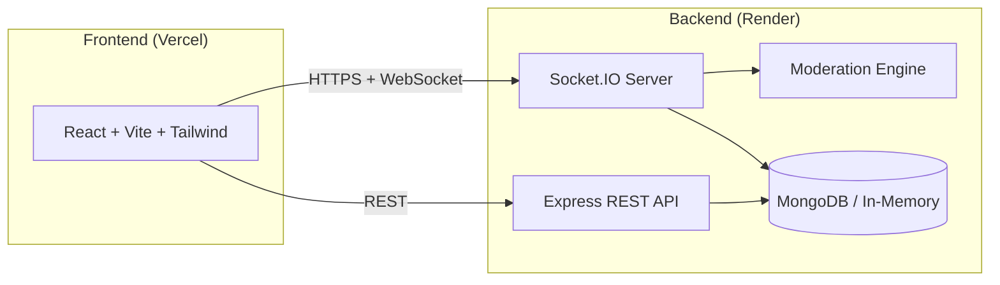

<div align="center">

# ⚡ QuickChat

### Talk to strangers instantly. No signup stress. No waiting around.

**One tap → live match → real-time chat.**

[](https://realtime-chat-w7a3.vercel.app)
[](https://realtimechat-kz1j.onrender.com/api/health)
[](https://react.dev)
[](https://socket.io)
[](LICENSE)

[Try it live](https://realtime-chat-w7a3.vercel.app) · [Report a bug](https://github.com/jasnajais/RealtimeChat/issues) · [Request a feature](https://github.com/jasnajais/RealtimeChat/issues)

</div>

---

## Why QuickChat?

Most chat apps make you jump through hoops — long signups, slow matching, cluttered UIs.

**QuickChat** is the opposite:

- Hit **Random Chat** and get paired with someone online in seconds
- Stay **anonymous** with auto-generated usernames
- Chat in **real time** with typing indicators, reactions, and GIFs
- Earn **XP, levels, and badges** just by being active
- Built with **safety in mind** — reports, blocks, spam limits, and toxicity filters

Perfect for portfolio showcases, learning WebSockets, or spinning up your own Omegle-style experience.

---

## ✨ Features

| Feature | What it does |
|--------|----------------|
| 🎲 **Instant Random Matching** | Jump into a live stranger chat with one click — no filters, no friction |
| 💬 **Real-Time Messaging** | Socket.IO powered chat with typing indicators and delivery feedback |
| 😂 **Reactions & GIFs** | React to messages with emojis or drop GIF links mid-conversation |
| 🧊 **Icebreakers** | Auto-generated conversation starters when things get quiet |
| 🏆 **XP & Leaderboard** | Level up, earn badges, and climb the global rankings |
| 🛡️ **Moderation System** | Toxicity filtering, rate limits, report/block tools, and admin dashboard |
| 🔔 **Push Notifications** | Get alerted the moment you match with someone new |
| 📱 **Mobile-First UI** | Sleek dark theme built with Tailwind — looks great on phone and desktop |
| ⚙️ **Profile Settings** | Sound toggles, compact mode, streaks, and personal stats |
| 👮 **Admin Dashboard** | Review reports, ban/unban users, and manage the community |

---

## 🏗️ Architecture



| Layer | Stack |
|-------|-------|
| **Frontend** | React 19, Vite 8, Tailwind CSS, Lucide Icons, Socket.IO Client |
| **Backend** | Node.js, Express 5, Socket.IO 4, JWT Auth, bcrypt |
| **Database** | MongoDB via Mongoose (falls back to in-memory if unavailable) |
| **Deploy** | Vercel (frontend) + Render (backend) |

---

## 🚀 Live Demo

| Service | URL |
|---------|-----|
| 🌐 **App** | [realtime-chat-w7a3.vercel.app](https://realtime-chat-w7a3.vercel.app) |
| 🩺 **API Health** | [realtimechat-kz1j.onrender.com/api/health](https://realtimechat-kz1j.onrender.com/api/health) |

> **Note:** The Render free tier may cold-start after inactivity. Give the backend ~30 seconds on first load.

---

## 🖼️ Preview

```
┌─────────────────────────────────────────────┐
│  ⚡ QuickChat                    [Profile]  │
│                                             │
│         Anonymous Stranger Random Chat      │
│     Jump into a live stranger chat in       │
│              one tap.                       │
│                                             │
│   ┌──────────┐    ┌──────────────┐          │
│   │ Online   │    │ Matches      │          │
│   │   42     │    │  14.3K+      │          │
│   └──────────┘    └──────────────┘          │
│                                             │
│        [ ⚡ RANDOM CHAT — LIVE NOW ]        │
│                                             │
│              Created by Jasna                 │
└─────────────────────────────────────────────┘
```

---

## 🛠️ Local Development

### Prerequisites

- [Node.js](https://nodejs.org/) 18+
- [npm](https://www.npmjs.com/) 9+
- (Optional) [MongoDB](https://www.mongodb.com/) for persistent user data

### 1. Clone the repo

```bash
git clone https://github.com/jasnajais/RealtimeChat.git
cd RealtimeChat
```

### 2. Configure environment variables

**Backend** — create a `.env` file in the project root:

```env
PORT=4000
JWT_SECRET=your-secret-key
# MONGODB_URI=mongodb://127.0.0.1:27017/realtimechat
ALLOWED_ORIGINS=http://localhost:5173
```

**Frontend** — create `client/.env` (optional for local dev):

```env
VITE_SOCKET_URL=http://localhost:4000
```

### 3. Install dependencies

```bash
# Backend
npm install

# Frontend
npm install --prefix client
```

### 4. Run both servers

**Terminal 1 — Backend:**
```bash
npm run dev
```

**Terminal 2 — Frontend:**
```bash
npm run dev --prefix client
```

Open **http://localhost:5173** and start chatting.

---

## ☁️ Deployment

QuickChat uses a **split deployment** — frontend on Vercel, backend on Render — because Vercel cannot host persistent WebSocket servers.

### Frontend → Vercel

1. Import the GitHub repo into [Vercel](https://vercel.com)
2. Vercel reads `vercel.json` automatically
3. Add environment variable (optional):

| Key | Value |
|-----|-------|
| `VITE_SOCKET_URL` | `https://your-backend.onrender.com` |

### Backend → Render

1. Create a **Web Service** on [Render](https://render.com)
2. Use `render.yaml` or set manually:
   - **Build:** `npm install`
   - **Start:** `node server.js`
   - **Health check:** `/api/health`
3. Add environment variables:

| Key | Value |
|-----|-------|
| `JWT_SECRET` | A strong random secret |
| `ALLOWED_ORIGINS` | Your Vercel URL |
| `MONGODB_URI` | Your MongoDB connection string (optional) |

---

## 📁 Project Structure

```
RealtimeChat/
├── client/                  # React frontend (Vite + Tailwind)
│   ├── public/              # Logo, favicon, static assets
│   └── src/
│       ├── components/      # Shared UI components
│       ├── config/          # Backend URL config
│       └── pages/           # Landing, Match, Chat, Leaderboard, Admin...
├── backend/
│   ├── config/              # Database connection
│   ├── middleware/          # JWT auth middleware
│   ├── models/              # User, Match, Report schemas
│   ├── routes/              # REST API routes
│   ├── sockets/             # Socket.IO event handlers
│   └── utils/               # Gamification, moderation helpers
├── server.js                # Express + Socket.IO entry point
├── render.yaml              # Render deployment config
└── vercel.json              # Vercel deployment config
```

---

## 🔌 API Overview

| Method | Endpoint | Description |
|--------|----------|-------------|
| `GET` | `/api/health` | Server & database status |
| `POST` | `/api/auth/register` | Register / login with username |
| `GET` | `/api/stats/leaderboard` | Global XP rankings |
| `GET` | `/api/stats/profile/:username` | User profile & stats |
| `GET` | `/api/mod/reports` | Admin: fetch reports |
| `POST` | `/api/mod/ban` | Admin: ban a user |

### Socket.IO Events

| Event | Direction | Purpose |
|-------|-----------|---------|
| `join-random-chat` | Client → Server | Enter the matchmaking queue |
| `matched` | Server → Client | Paired with a stranger |
| `stranger-message` | Both | Send / receive messages |
| `stranger-typing` | Both | Typing indicators |
| `skip-match` | Client → Server | Skip current stranger |
| `report-stranger` | Client → Server | Report abusive behavior |
| `online-count-update` | Server → Client | Live online user count |

---

## 🤝 Contributing

Contributions are welcome! Here's how:

1. **Fork** the repository
2. **Create** a feature branch: `git checkout -b feature/amazing-feature`
3. **Commit** your changes: `git commit -m "Add amazing feature"`
4. **Push** to the branch: `git push origin feature/amazing-feature`
5. **Open** a Pull Request

Found a bug? [Open an issue](https://github.com/jasnajais/RealtimeChat/issues) — screenshots and steps to reproduce help a lot.

---

## ⭐ Show Some Love

If QuickChat helped you learn WebSockets, land a project idea, or just killed boredom — **star this repo** ⭐

It helps more developers discover the project and keeps development going.

---

## 👩‍💻 Author

**Jasna Jaison**

- GitHub: [@jasnajais](https://github.com/jasnajais)
- Project: [RealtimeChat](https://github.com/jasnajais/RealtimeChat)

---

<div align="center">

**Built with React, Socket.IO, and way too much caffeine.**

*QuickChat — because great conversations shouldn't need a signup form.*

</div>
